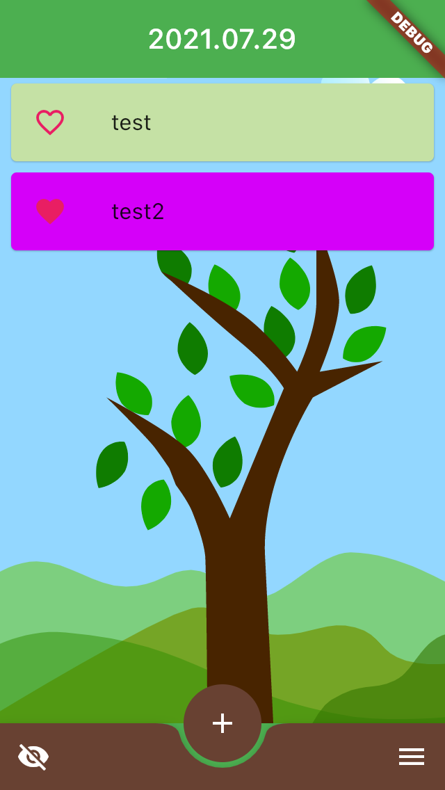
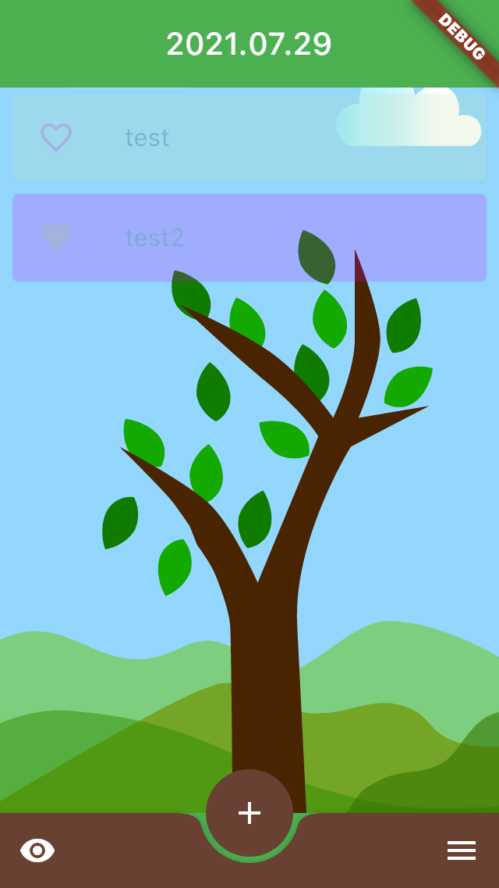
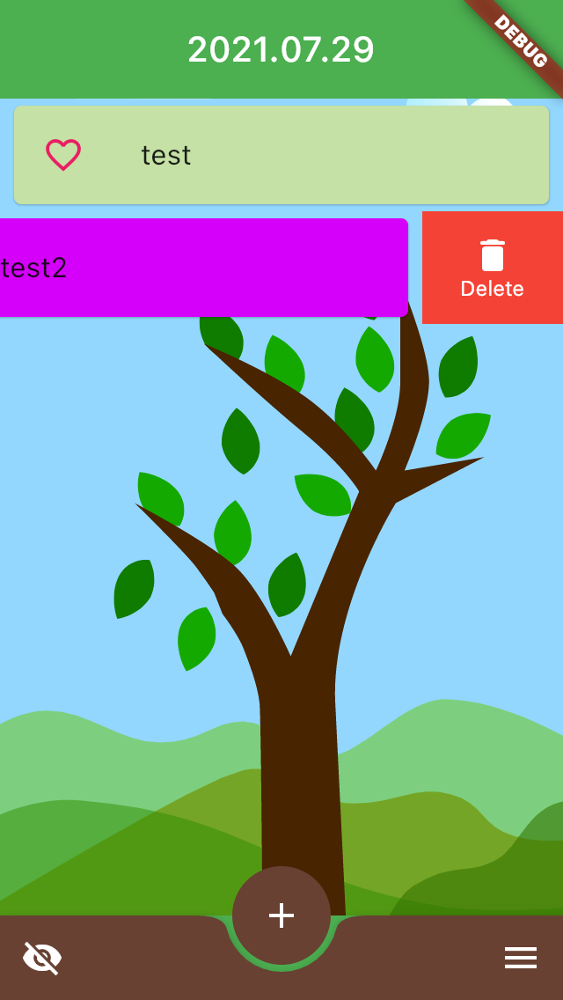
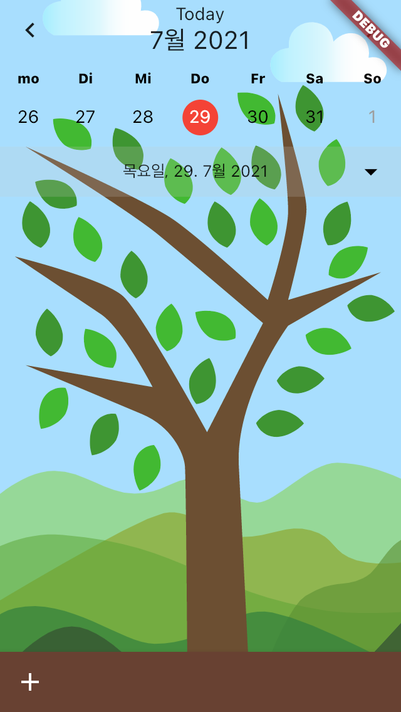
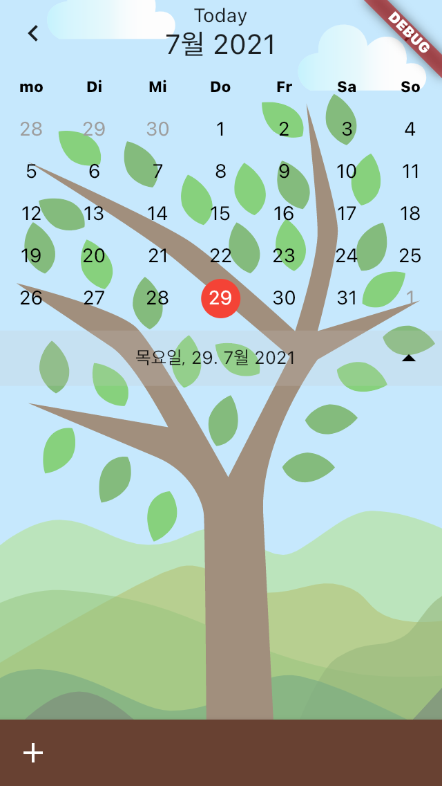

# toTrist

## Developer
ParkMingyeong JangjongWon
[LeejeongSeok](https://adjoining-dryosaurus-a90.notion.site/JEONGSEOK-LEE-eca35bb9a8be48feb92029bf2f8a3298)

## 프레임 워크
Flutter
IOS/Android

## 개발 목표
1. Flutter을 통한 크로스 플랫폼 연습
2. TodoList를 작성하여 달성도에 따라 나무가 자라는 애니메이션을 넣어줌
3. 날짜에 따라 해당 계절의 나무를 보여주어 색다름을 줌.
4. 달력의 날짜를 클릭하여 해당 날짜에 키운 나무를 볼 수 있음.

## 구현
|텝1      |텝2     |
|--------|--------|
|TodoList|Calendar|

# TodoList
main Image
|default|Clickvisible|Slide|
|--------|--------|------|
||||
|기본 이미지|우측 하단 버튼 클릭시|Slide시|

# Calendar
TodoList의 우측 하단 버튼 클릭시 텝 전환

|fold|unfold|
|--------|--------|
|||
|기본 이미지|달력 하단의 열기 버튼 클릭시|